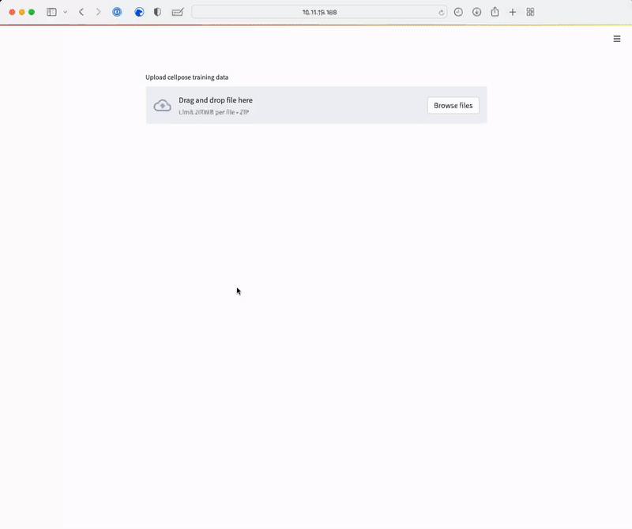

# Cellpose Training Server

Tool to train custom cellpose models via the browser on a remote server with GPU support, given cellpose training images generated using the [Cellpose Annotation Tool](https://git.embl.de/grp-alexandrov/cellpose-training-gui) tool.



## Installation and usage on the server with GPU support

### How to build the docker image

- Clone this repository with `git clone git@git.embl.de:grp-alexandrov/cellpose-training-server.git`

- Move to the repository folder with `cd cellpose-training-server`

- Build the docker image with `docker build -t cellposetrainingserverapp:latest ./doverkfiles`

### How to start the docker image 

- If you want to temporarily start the docker image, you can run the following command:

  ```shell
  docker run -p 8501:8501 --gpus all cellposetrainingserverapp:latest
  ```

- If you want to start the docker image and keep it running in the background (even when your server is restarted), you can run the following command:

  ```shell
  docker run -p 8501:8501 --gpus all --restart unless-stopped -d  cellposetrainingserverapp:latest
  ```
  
Afterwards, you can access the tool via the browser at `http://localhost:8501`
